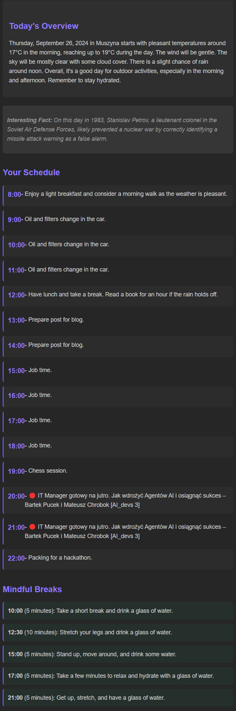

# Mindful Day AI

Mindful Day AI is an AI-powered application that helps manage your daily schedule. It gathers weather data, tasks from Google Tasks, and events from Google Calendar, then generates suggestions and sends a daily plan via email.

## Features
- **Google Calendar Integration**: Fetches events for the day from Google Calendar.
- **Google Tasks Integration**: Retrieves the list of tasks from Google Tasks.
- **Weather API Integration**: Provides weather forecasts for a selected city.
- **AI-powered Suggestions**: Uses AI to generate a personalized daily plan based on weather, tasks, and events.
- **Email Notifications**: Automatically sends the generated plan via email.

## Installation

1. Clone the repository:
    ```bash
    git clone https://github.com/patrykmurzyn/Mindful-Day-AI.git
    cd mindful-day-ai
    ```

2. Install the required dependencies:
    ```bash
    pip install -r requirements.txt
    ```

3. Set up environment variables:
   Create a `.env` file and add the following values:
    ```bash
    WEATHERAPI_API_KEY=<your-api-key-from-https://www.weatherapi.com/>
    GENAI_API_KEY=<your-api-key-from-https://aistudio.google.com/>
    ```

4. Obtain Google APIs Credentials:
* Create a Google Cloud Project: If you don't have one, create a new project in the Google Cloud Console.
* Enable the required APIs: In your Google Cloud Project, navigate to the API Library and enable the following APIs:
    * Google Calendar API
    * Google Tasks API
    * Gmail API
* Create Credentials: In the Credentials section, create an OAuth client ID. Choose "Desktop app" as the application type. Download the credentials file, rename it to secret.json, and place it in the tokens directory.
* Generate Tokens: On the first run, the application will prompt you to authorize access to the APIs. This generates token files, stored in the tokens directory, for subsequent API calls, eliminating the need to re-authorize every time.

5. Run the application:
    ```bash
    python3 src/main.py
    ```

## How it works

- The application retrieves events and tasks from your Google Calendar and Google Tasks, respectively.
- It fetches weather data for the specified city using the Weather API.
- Using this data, it generates a personalized daily plan via an AI-powered API (GenAI).
- The generated plan is emailed to the specified address.


